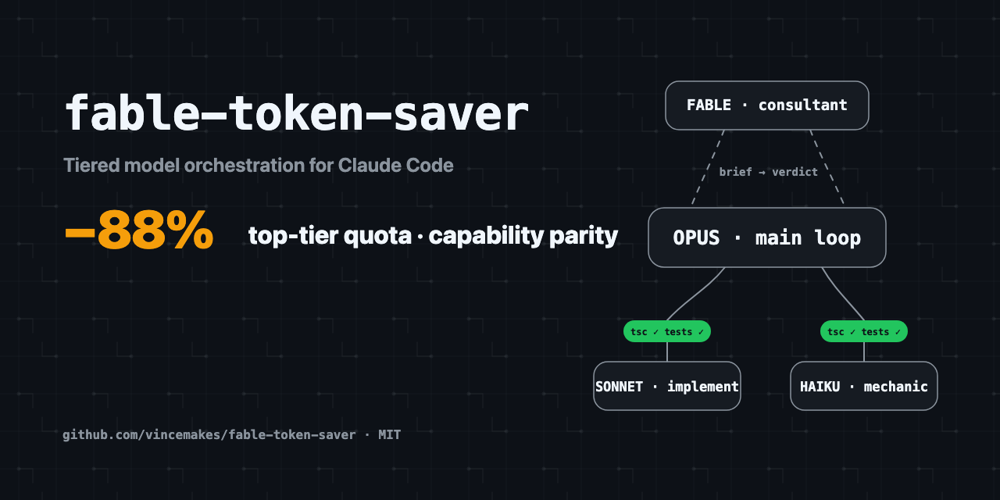

# Token Saver



**English** | [简体中文](README.zh-CN.md)

Token Saver is a model-independent orchestration protocol for [Claude Code](https://docs.anthropic.com/en/docs/claude-code) and [Codex](https://github.com/openai/codex). It keeps the model already selected for the conversation as the main loop, then places planning, implementation, gates, and review around it without silently changing that model.

Canonical repository: [https://github.com/vincemakes/token-saver](https://github.com/vincemakes/token-saver)

## Should you use it?

Use Token Saver when a task is bounded, constructive, and large enough to repay orchestration overhead: a material multi-file implementation, a migration, repeated mechanical changes, or independent packets with testable acceptance criteria.

Let the main loop work normally for a tiny edit, pure conversation or analysis, unresolved root-cause debugging, or a design/security decision that cannot yet be expressed as acceptance criteria. Rough signals such as 300+ changed lines or 6+ files can help, but task shape matters more than a fixed threshold.

The published measurements are a historical Claude/Fable/Opus snapshot, not a promise for every model profile. See the [scoped benchmark report](BENCHMARKS.md) before choosing Token Saver for cost or quota reasons.

## Lite and Max at a glance

Lite and Max describe where authority lives. They do not name a provider, price tier, or universal model-quality ranking.

| Mode | Authority topology | Worker |
|---|---|---|
| **Lite** | The inherited main loop plans, performs both authority checks, reviews, and integrates. | An optional worker can implement, scout, or perform mechanical work. |
| **Max** | A distinct, verified authority reviewer checks the plan and final evidence while the inherited main loop coordinates and reviews. | The worker is optional; Max can have two levels or three. |

```text
Lite
authority main loop ── plans / reviews / integrates ──> optional worker

Max
authority reviewer <── plan and final evidence ── inherited main loop
                                                   └── optional worker
```

Examples are capability mappings, not hard-coded provider rules:

- Fable or Opus as the main loop with a lower Claude worker is Lite.
- Sol as the main loop with Terra or Luna workers is Lite.
- Terra as the main loop with a Sol reviewer and an optional Luna worker is Max.
- Kimi K3 can be an authority-capable external route only when its exact model identity is pinned, verified live, read-only, and distinct from the main loop.

A separate worker is never required. Lite may run entirely in the main loop; Max always requires its separate reviewer but may let the main loop implement.

## The main loop is already selected

The host-selected conversation model is immutable input. Token Saver never replaces it, and profile, user, project, or per-run configuration must not contain a substitute main loop. If the host cannot establish the main loop's canonical `provider_family:resolved_model_id:variant` fingerprint, resolution stops with `needs_context`.

Route names, wrapper names, endpoints, accounts, and model-family prose are hints, not identity proof. Two different aliases that resolve to the same canonical fingerprint are the same model for authority-separation purposes.

## How the shared state machine works

Lite and Max use the same ordered state machine:

```text
RESOLVE -> PREFLIGHT -> CLASSIFY -> RECON -> DRAFT_PLAN -> AUTHORITY_PLAN_CHECK -> DISPATCH -> GATE -> PATCH_AUDIT -> MAIN_LOOP_REVIEW -> AUTHORITY_FINAL_CHECK -> INTEGRATE
```

Lite binds both authority checkpoints to the main loop inline. Max binds both checkpoints to one distinct eligible reviewer. Max cannot dispatch before plan approval, and neither mode can integrate before gates, a complete patch audit, main-loop review, and final approval.

Workers receive a bounded task packet instead of conversation history. They work in a disposable worktree, and their claims are checked against independently captured process and Git evidence. Final approval is bound to exactly:

```text
source_snapshot_hash
worker_delta_hash
projected_task_patch_hash
```

If any evidence or destination state changes, the old approval cannot be reused. The full state, evidence, retry, and integration contract is in the [protocol reference](references/protocol.md).

## Model profiles, not model lock-in

Profiles provide capability-based route defaults:

- **authority** routes may review in Max or keep authority inline in Lite.
- **balanced** routes may coordinate or implement.
- **fast** routes may implement, scout, or perform mechanical work.

Those declarations are candidates, not proof. Preflight must verify live reachability, exact effective identity, permissions, credential names, and—when an external command can write—a sandbox bound to that exact invocation.

Built-in profiles cover Claude, OpenAI, and Kimi examples, while project and user configuration can replace route definitions. Resolution follows profile → user → project → per-run precedence and never mutates the inherited main loop. See [routing and capability resolution](references/routing.md) for the complete rules.

## Claude Code setup

These are fresh-install commands. Each scope installs the skill plus the four host-specific role declarations.

### POSIX — user scope

```bash
mkdir -p "$HOME/.claude/skills"
git clone https://github.com/vincemakes/token-saver.git "$HOME/.claude/skills/token-saver"
mkdir -p "$HOME/.claude/agents"
for role in reviewer implementer mechanic scout; do
  install -m 0644 "$HOME/.claude/skills/token-saver/assets/agents/claude-code/$role.md" \
    "$HOME/.claude/agents/token-saver-$role.md"
done
```

### POSIX — project scope

```bash
mkdir -p .claude/skills
git clone https://github.com/vincemakes/token-saver.git .claude/skills/token-saver
mkdir -p .claude/agents
for role in reviewer implementer mechanic scout; do
  install -m 0644 ".claude/skills/token-saver/assets/agents/claude-code/$role.md" \
    ".claude/agents/token-saver-$role.md"
done
```

### PowerShell — user scope

```powershell
$skill = Join-Path $HOME ".claude\skills\token-saver"
$agents = Join-Path $HOME ".claude\agents"
New-Item -ItemType Directory -Force (Split-Path $skill -Parent) | Out-Null
git clone https://github.com/vincemakes/token-saver.git $skill
New-Item -ItemType Directory -Force $agents | Out-Null
foreach ($role in "reviewer", "implementer", "mechanic", "scout") {
  Copy-Item (Join-Path $skill "assets\agents\claude-code\$role.md") `
    (Join-Path $agents "token-saver-$role.md")
}
```

### PowerShell — project scope

```powershell
$skill = ".claude\skills\token-saver"
$agents = ".claude\agents"
New-Item -ItemType Directory -Force (Split-Path $skill -Parent) | Out-Null
git clone https://github.com/vincemakes/token-saver.git $skill
New-Item -ItemType Directory -Force $agents | Out-Null
foreach ($role in "reviewer", "implementer", "mechanic", "scout") {
  Copy-Item (Join-Path $skill "assets\agents\claude-code\$role.md") `
    (Join-Path $agents "token-saver-$role.md")
}
```

## Codex setup

Check the installed CLI first:

```bash
codex --version
```

GPT-5.6 Sol requires Codex CLI `0.144.0` or later. Token Saver setup does not run or recommend an automatic upgrade; if the installed version is older, stop before selecting the Sol profile.

The bundled Sol profile treats Sol as an authority route, Terra as a balanced route, and Luna as a fast route. These are fresh-install commands for the skill and four Codex agent declarations.

### POSIX — project scope

```bash
mkdir -p .agents/skills
git clone https://github.com/vincemakes/token-saver.git .agents/skills/token-saver
mkdir -p .codex/agents
for role in reviewer implementer mechanic scout; do
  install -m 0644 ".agents/skills/token-saver/assets/agents/codex/$role.toml" \
    ".codex/agents/token-saver-$role.toml"
done
```

### POSIX — user scope

```bash
mkdir -p "$HOME/.agents/skills"
git clone https://github.com/vincemakes/token-saver.git "$HOME/.agents/skills/token-saver"
mkdir -p "$HOME/.codex/agents"
for role in reviewer implementer mechanic scout; do
  install -m 0644 "$HOME/.agents/skills/token-saver/assets/agents/codex/$role.toml" \
    "$HOME/.codex/agents/token-saver-$role.toml"
done
```

### PowerShell — project scope

```powershell
$skill = ".agents\skills\token-saver"
$agents = ".codex\agents"
New-Item -ItemType Directory -Force (Split-Path $skill -Parent) | Out-Null
git clone https://github.com/vincemakes/token-saver.git $skill
New-Item -ItemType Directory -Force $agents | Out-Null
foreach ($role in "reviewer", "implementer", "mechanic", "scout") {
  Copy-Item (Join-Path $skill "assets\agents\codex\$role.toml") `
    (Join-Path $agents "token-saver-$role.toml")
}
```

### PowerShell — user scope

```powershell
$skill = Join-Path $HOME ".agents\skills\token-saver"
$agents = Join-Path $HOME ".codex\agents"
New-Item -ItemType Directory -Force (Split-Path $skill -Parent) | Out-Null
git clone https://github.com/vincemakes/token-saver.git $skill
New-Item -ItemType Directory -Force $agents | Out-Null
foreach ($role in "reviewer", "implementer", "mechanic", "scout") {
  Copy-Item (Join-Path $skill "assets\agents\codex\$role.toml") `
    (Join-Path $agents "token-saver-$role.toml")
}
```

## Kimi and GLM external routes

From the installed checkout, `bash scripts/setup-model-providers.sh` installs the existing compatibility wrappers. Their exact role mapping is:

| Route role | Reviewer transport base command | Write command allowed only inside verified OS sandbox |
|---|---|---|
| Kimi reviewer candidate | `claude-kimi` | — |
| Kimi implementer | — | `claude-kimi-bypass -p` |
| GLM reviewer candidate | `claude-glm` | — |
| GLM implementer | — | `claude-glm-bypass -p` |
| GLM fast scout/mechanic | `claude-glm-turbo` | `claude-glm-turbo-bypass -p` |

Plain wrappers are not inherently read-only. Reviewer transport appends `--safe-mode --no-session-persistence --permission-mode plan --tools "" -p`, runs from an isolated evidence directory, disables repository and tool access, and verifies that directory did not mutate. Even then, a candidate is ineligible for Max until preflight proves its exact model fingerprint and separation from the main loop.

A command name is not proof of model identity and never establishes independence. Codex can invoke an existing `claude-kimi*` command as an external route; this does not make Kimi appear natively in the Codex model picker. Wrapper installation never makes Kimi or GLM a native picker entry.

Write-capable bypass routes launch only inside a verified OS sandbox bound to the command, disposable worktree, route state, and sandbox profile. On any OS without a verified backend, Token Saver returns `sandbox_unavailable` without launching the writer.

## Safety and failure behavior

Token Saver fails closed:

- An explicit Max request never silently degrades to Lite. An unavailable, colliding, unverified, or effectively write-capable reviewer blocks dispatch.
- External writers never run in the user's repository. They receive only named credentials in a minimal child environment and can write only inside an invocation-owned disposable worktree.
- A worker may self-fix failed gates at most three times. Final authority review allows two revision rounds; a third `revise` returns `review_revise` without integration.
- Out-of-scope writes return `scope_violation`. Changed evidence returns `approval_stale`. Destination drift returns `destination_changed` and requires a fresh snapshot, audit, main-loop review, and authority approval.
- Failures report concise non-secret evidence and preserve user changes. Cleanup removes only invocation-owned resources.

The complete public status set is:

```text
ok
needs_context
gate_failed
provider_unavailable
reviewer_unavailable
timeout
scope_violation
transport_error
review_revise
approval_stale
destination_changed
sandbox_unavailable
```

## Reference benchmark snapshot

The [full benchmark report](BENCHMARKS.md) is a historical reference for the 2026 Claude/Fable/Opus stack. It does not predict savings for Sol, Kimi, or future profiles.

In that recorded large constructive run, Lite changed strongest-model output tokens by `-42%` and used a `-34%` price-weighted quota proxy; Max changed strongest-model output tokens by `-89%` and used a `-88%` quota proxy. Those are different measurements and should not be interchanged. The blind bug-hunt is one observed probe, not general proof, and the report preserves its single-run caveat, raw figures, methodology, and negative results.

## When Token Saver steps aside

Token Saver steps aside before dispatch for tiny edits, pure conversation, unresolved debugging, judgment-dense work without testable acceptance criteria, or tasks below the delegation floor. It also stops rather than improvising when identity, reviewer, provider, sandbox, gate, scope, approval, or destination invariants fail.

Stepping aside leaves the inherited main loop in charge. It does not switch models, invent a route, weaken Max, or treat orchestration already spent as a reason to continue unsafely.

## License

[MIT](LICENSE)
